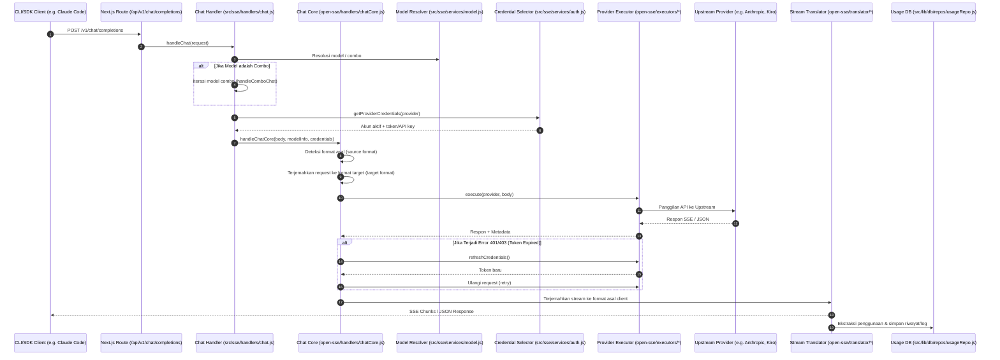

# 9Router System Map

Dokumen ini berfungsi sebagai peta navigasi utama untuk memahami arsitektur, alur data, struktur direktori, konfigurasi, integrasi eksternal, serta risiko/blind spots dalam proyek `9router-lite`.

---

## 1. Ringkasan Proyek (Project Summary)

`9router-lite` adalah gateway perutean AI lokal (local AI routing gateway) dan dashboard manajemen berbasis Next.js. Aplikasi ini menyediakan satu endpoint kompatibel OpenAI (`/v1/*`) dan merutekan lalu lintas permintaan ke lebih dari 40 penyedia layanan AI (upstream providers) dan 100+ model.

### Fitur Utama:
* **RTK Token Saver**: Mengompresi konten `tool_result` secara otomatis untuk menghemat 20-40% token per permintaan.
* **Auto Fallback**: Mekanisme fallback berjenjang (Subscription → Cheap → Free) untuk menjamin ketersediaan layanan tanpa downtime.
* **Multi-Account Round-Robin**: Rotasi akun per penyedia layanan untuk menghindari batas kuota/rate limit.
* **Format Translation**: Penerjemahan format request/response secara transparan antara berbagai ekosistem (OpenAI, Claude, Gemini, dll.).
* **Persistence**: Penyimpanan data aplikasi utama menggunakan CockroachDB/PostgreSQL melalui `DATABASE_URL`, dengan file lokal hanya untuk secret, runtime, dan backup.

---

## 2. Alur Logika Utama (Core Logic Flow)

Berikut adalah alur eksekusi permintaan chat completion (`/v1/chat/completions`):



---

## 3. Pohon Direktori Bersih (Clean Directory Tree)

Struktur folder utama proyek `9router-lite`:

```
9router-lite/
├── cli/                            # Paket CLI untuk menjalankan 9Router secara lokal
│   ├── cli.js                      # Entrypoint CLI
│   ├── hooks/                      # Script runtime (tray, postinstall)
│   └── scripts/                    # Script build CLI dan MITM
├── docs/                           # Dokumentasi arsitektur proyek
├── gitbook/                        # Aplikasi dokumentasi terpisah (GitBook)
├── open-sse/                       # Core routing, eksekusi, dan translasi SSE
│   ├── config/                     # Konfigurasi model, provider, dan runtime
│   ├── executors/                  # Adapter eksekusi untuk masing-masing provider
│   ├── handlers/                   # Handler utama chatCore, ttsCore, sttCore, dll.
│   ├── translator/                 # Mesin penerjemah request/response antar format
│   └── utils/                      # Utilitas stream, proxy, error, dan cloaking
├── public/                         # Aset statis untuk dashboard UI
├── skills/                         # Definisi skill/kemampuan bawaan 9Router
├── src/                            # Aplikasi Next.js (Dashboard & API)
│   ├── app/                        # Next.js App Router (Pages & API Routes)
│   │   ├── (dashboard)/            # Halaman Dashboard UI (Providers, Settings, dll.)
│   │   └── api/                    # API Management (/api/*) & Compatibility (/api/v1/*)
│   ├── lib/                        # Pustaka internal (Database, Cloud Sync, Proxy)
│   │   └── db/                     # Lapisan database remote (driver, repos, migrasi)
│   ├── shared/                     # Komponen UI bersama, konstanta, dan utilitas
│   └── sse/                        # Handler SSE tingkat tinggi (chat, model, auth)
└── tests/                          # Paket pengujian unit dan integrasi
```

---

## 4. Peta Modul (Module Map)

### A. API & Routing Layer (`src/app/api/`)
* **Compatibility APIs (`src/app/api/v1/` & `src/app/api/v1beta/`)**:
  * `chat/completions/route.js`: Endpoint utama untuk chat completion kompatibel OpenAI.
  * `messages/route.js`: Endpoint kompatibel Anthropic Messages.
  * `models/route.js`: Menyediakan daftar model yang tersedia.
* **Management APIs (`src/app/api/`)**:
  * `providers/`: CRUD koneksi provider (`route.js`, `[id]/route.js`).
  * `provider-nodes/`: CRUD node kompatibel kustom.
  * `usage/`: Mengambil statistik penggunaan, log, dan data grafik.
  * `settings/`: Pengaturan aplikasi dan konfigurasi database.

### B. SSE & Translation Core (`open-sse/`)
* **`handlers/chatCore.js`**: Mengatur alur penerjemahan request, pemanggilan executor, penanganan error, token refresh, dan inisiasi penerjemahan response.
* **`executors/`**:
  * `base.js`: Kelas dasar untuk semua executor.

### C. Release / Update Metadata
* **`src/shared/constants/config.js`**: Sumber konfigurasi versi UI, URL changelog GitHub, dan perintah updater manual yang ditampilkan di sidebar dashboard.
* **`src/shared/constants/skills.js`**: Sumber repo/branch/path untuk link raw/blob skill pada halaman `/dashboard/skills`; saat ini diarahkan ke `zcuss/9router-lite` branch `master`.
  * `antigravity.js`, `cursor.js`, `kiro.js`, `codex.js`, `gemini-cli.js`: Executor khusus dengan penanganan autentikasi dan endpoint unik.
  * `default.js`: Executor fallback untuk provider standar.
* **`translator/`**:
  * `index.js`: Registry dan orkestrator translasi.
  * `request/`: Penerjemah request (misal: `openai-to-claude.js`, `openai-to-gemini.js`).
  * `response/`: Penerjemah response (misal: `claude-to-openai.js`, `gemini-to-openai.js`).

### C. Persistence Layer (`src/lib/db/`)
* **`driver.js`**: Menginisialisasi adapter database remote CockroachDB/PostgreSQL berdasarkan `DATABASE_URL` / `DB_DRIVER`.
* **`schema.js`**: Definisi skema tabel database (settings, providerConnections, providerNodes, proxyPools, apiKeys, combos, kv, usageHistory, requestDetails).
* **`repos/`**:
  * `connectionsRepo.js`: Manajemen koneksi provider (termasuk parsing boolean CockroachDB/Postgres).
  * `settingsRepo.js`: Manajemen konfigurasi global.
  * `usageRepo.js`: Pencatatan riwayat penggunaan dan statistik token.

---

## 5. Data & Konfigurasi (Data & Config)

### Database:
* **Lokasi**: CockroachDB / PostgreSQL yang ditentukan oleh `DATABASE_URL`.
* **Tabel Utama**:
  * `settings`: Menyimpan konfigurasi global (RTK, Caveman, requireApiKey, dll.).
  * `providerConnections`: Menyimpan kredensial akun provider (API Key, OAuth tokens, proxy, prioritas).
  * `combos`: Menyimpan definisi model combo (urutan fallback model).
  * `usageHistory`: Log transaksi token, biaya, dan status request.

### Konfigurasi Runtime (`open-sse/config/`):
* `providers.js`: Daftar provider yang didukung beserta format default-nya.
* `models.js`: Metadata model bawaan (token limit, pricing, strip options).
* `runtimeConfig.js`: Konstanta HTTP status dan konfigurasi timeout.

---

## 6. Integrasi Eksternal (External Integrations)

* **Upstream AI Providers**:
  * **OAuth-based**: Claude Code, Codex, Gemini, Qwen, iFlow, GitHub, Kiro, Cursor, Antigravity.
  * **API Key-based**: OpenAI, Anthropic, OpenRouter, GLM, Kimi, MiniMax.
  * **Local/Self-hosted**: Ollama.
* **Cloud Sync**:
  * Sinkronisasi state database lokal ke server cloud (`NEXT_PUBLIC_CLOUD_URL`) secara berkala menggunakan scheduler (`src/shared/services/cloudSyncScheduler.js`).
* **Proxy Support**:
  * Mendukung perutean lalu lintas upstream melalui proxy HTTP/HTTPS atau Vercel Relay yang dikonfigurasi per koneksi.

---

## 7. Risiko & Blind Spots (Risks & Blind Spots)

* **CockroachDB/Postgres Boolean Parsing**: Beberapa database cloud mengembalikan nilai boolean sebagai string (`"true"`/`"false"`) atau angka (`1`/`0`). Gunakan fungsi pembantu `parseDbBoolean` saat membaca kolom `isActive` atau flag boolean lainnya dari database.
* **Compatible Base URL Normalization**: Pengguna sering memasukkan URL endpoint lengkap (seperti `https://api.example.com/v1/chat/completions`) pada kolom Base URL untuk provider kompatibel. URL ini harus dinormalisasi (dihapus path `/chat/completions` atau `/v1`) sebelum melakukan pemanggilan ke endpoint `/models`.
* **OAuth Token Expiration**: Provider berbasis OAuth memerlukan mekanisme refresh token yang andal. Jika refresh gagal di tengah jalan, request akan gagal dengan error 401/403. Pastikan penanganan error di `chatCore.js` dapat memicu `refreshCredentials` dengan benar.
* **Webpack Build Dependency**: Aplikasi Next.js di root menggunakan konfigurasi Webpack kustom secara eksplisit. Perubahan pada konfigurasi bundler harus diuji dengan `npm run build` untuk memastikan tidak ada pemecahan modul (module resolution) yang rusak.
